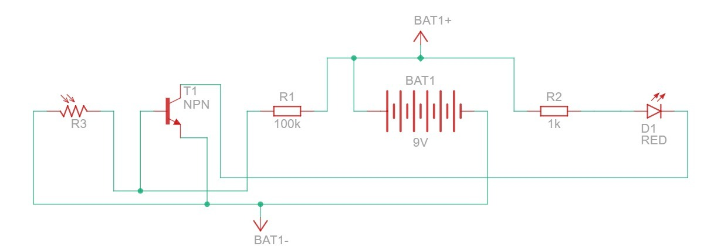
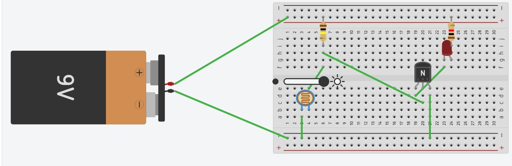
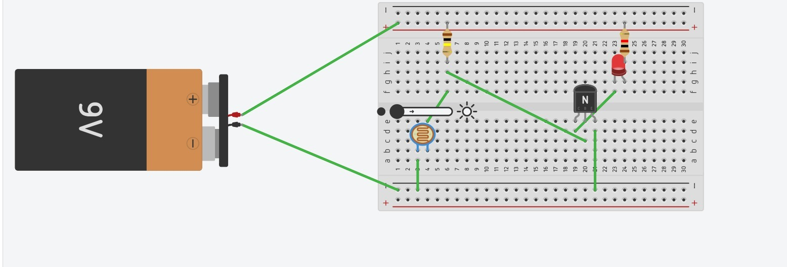
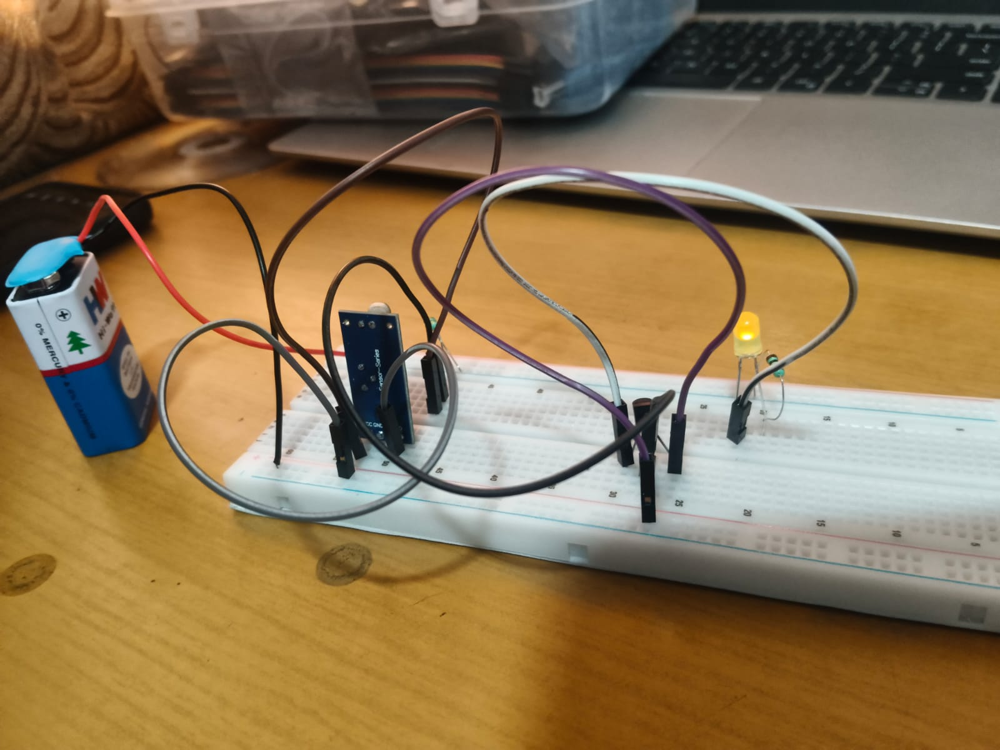
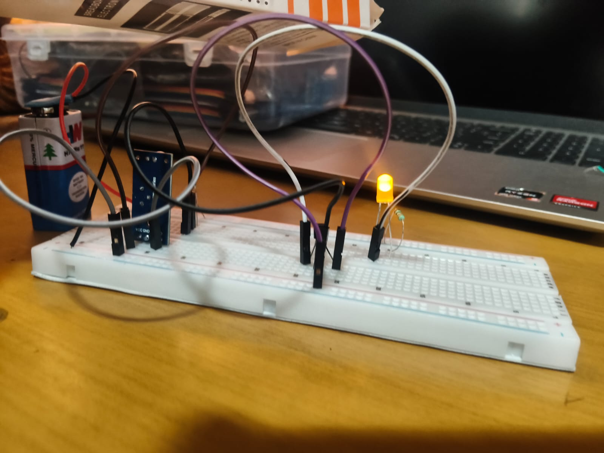

# AUTOMATIC DARK-ACTIVATED LED LIGHTING CIRCUIT USING LDR AND NPN TRANSISTOR

 1\. TITLE  
Automatic Dark-Activated LED Lighting Circuit Using LDR and NPN Transistor

 2\. PROBLEM STATEMENT  
Mining sites operate through both day and night, and their work areas, walkways and haul roads need adequate lighting at all times. Manual switching of lights is unreliable. Lights left on in daylight waste energy, and lights not switched on after dark endanger workers. Poor visibility can cause falls and can leave roads blocked by unseen obstacles, so reliable lighting is necessary for worker safety and smooth movement. A lighting system that responds to the surrounding light level without human intervention is therefore required.

 3\. SOLUTION  
An automatic light-sensing circuit is proposed. A light-dependent resistor (LDR) senses the ambient light, and an NPN transistor switches an LED accordingly. The LED turns \*\*on at night\*\* when the light level is low and \*\*off during the day\*\* when it is high. Team Link Force demonstrated the solution on a cardboard mine model (Figures 3.4 and 3.5).

 4\. OBJECTIVE  
To design an automatic light-sensing circuit that switches an LED on in darkness and off in daylight, as a lighting solution for mine sites, to verify its operation in simulation, and to demonstrate it on a hardware model.

5\. COMPONENTS USED  
 List of components used

| S.No | Component  | Quantity | Value / Rating | Purpose |
| :---: | :---: | :---: | :---: | :---: |
| 1 | DC battery | | 1  |  9 V | Power supply  |
| 2 | LDR (R3) |  | 1 | Resistance range to be confirmed | Senses light level |
| 3  | NPN transistor (T1) | 1 |  Part number to be confirmed | Switches the LED |
| 4 | Resistor R1  | 1 | 100 kΩ | Bias resistor for the transistor base |
| 5 | Resistor R2 | 1 |  1 kΩ | Limits the LED current  |
| 6 | LED (D1) | 1 | Red in schematic and simulation; yellow on hardware  | Light output |
| 7 | LDR sensor module (hardware only)  | 1 | Blue module marked VCC and GND; model to be confirmed  | Light-sensing stage in the hardware prototype  |
| 8 |  Solderless breadboard | 1 | Full-size | Circuit assembly  |
| 9 | Jumper wires  | As required | Single-core | Interconnections  |
| 10 |  Cardboard mine model | 1 | Tent-shaped enclosure  | Demonstration prototype |

 6\. CIRCUIT SETUP AND CONNECTIONS

6.1 Breadboard Circuit

The prototype was assembled on a solderless breadboard powered by a 9 V battery, as shown in Figure 3.1. The hardware used a ready-made LDR sensor module for the light-sensing stage, while the design and simulation use a discrete LDR, R1 and transistor. The photograph shows the battery, the blue sensor module, a yellow LED and the jumper wiring, with the LED lit.

   
Figure 3.1: Breadboard prototype with LDR sensor module, LED and 9 V battery

               
          
 6.2 Circuit Connections  
Table 3.2 lists the connections of the designed circuit, as drawn in the schematic in Figure 3.3. The internal wiring of the hardware sensor module is not documented here.

Table 3.2: Circuit connections

| S.No | From (Component / Pin)  | To (Component / Pin)  | Purpose |
| :---: | :---: | :---: | :---: |
| 1 | Battery positive (BAT1+)  |  R1, one terminal |  Supplies the bias voltage  |
| 2 | R1, other terminal | T1 base | Feeds base current |
| 3 | T1 base (same node as R1)  | LDR R3, one terminal  | Forms the voltage divider with R1  |
| 4 |  LDR R3, other terminal  | Battery negative (BAT1−)  | Completes the divider to ground  |
| 5 | Battery positive (BAT1+) | R2, one terminal | Supplies the LED branch  |
| 6 |  R2, other terminal  |  LED D1 anode | Limits the LED current |
| 7 | LED D1 cathode | T1 collector | Lets the transistor switch the LED |
| 8 | T1 emitter | Battery negative (BAT1−)  | Common return path  |

7\. SIMULATION  
The circuit was simulated in Tinkercad Circuits to verify the switching action, as shown in Figure 3.2. The light-level slider sets the illumination on the LDR.  
Figure 3.2: Circuit simulation  
    
                                                            (a) high light level, LED off

   

                                                           (b) low light level, LED on

 8\. CIRCUIT SCHEMATIC  
Figure 3.3 shows the schematic. R1 and the LDR form a voltage divider that biases the base of T1, and T1 switches the LED branch (R2 and D1).

    
                             
                           Figure 3.3: Circuit schematic of the LDR-controlled LED switch

9\. FUNCTION OF COMPONENTS

* 9 V battery: Powers both the sensing divider and the LED branch.

* LDR (R3): Its resistance falls as light increases and rises in darkness, which makes it the light-sensing element.  
    
* Resistor R1 (100 kΩ):Together with the LDR, it sets the base voltage. Its high value keeps the base current small.  
    
* NPN transistor (T1): Acts as an electronic switch. A small base current lets a larger current flow from collector to emitter through the LED.  
    
* Resistor R2 (1 kΩ):Limits the LED current. Without it, the LED would be damaged when the transistor conducts.  
    
* LED (D1): Provides the light output when the transistor conducts.  
    
* LDR sensor module (hardware): Performs the light-sensing function in the prototype in place of the discrete LDR.  
    
* Breadboard, jumper wires and cardboard model: The breadboard and wires provide solderless connections, and the model represents the mine site for demonstration.

 10\. WORKING PRINCIPLE

 10.1 Theory  
R1 and the LDR form a voltage divider whose midpoint drives the transistor base. Neglecting base current:

\*\*Vb \= Vs × R\_LDR / (R1 \+ R\_LDR)\*\*

The transistor conducts when Vb reaches about 0.7 V. Solving for the LDR resistance:

\*\*R\_LDR \= Vb × R1 / (Vs − Vb) \= 0.7 × 100 kΩ / (9 − 0.7) ≈ 8.4 kΩ\*\*

The LED therefore switches on when the LDR resistance rises above roughly 8.4 kΩ. This is a calculated threshold, since the LDR's actual resistance range is not specified.

When the transistor is fully on (assuming Vf ≈ 2 V and VCE(sat) ≈ 0.2 V):

I\_LED \= (Vs − Vf − VCE(sat)) / R2 ≈ (9 − 2 − 0.2) / 1000 ≈ 6.8 mA (calculated)

10.2 Step-by-Step Operation  
1\. Daytime (bright light):The LDR resistance is low, so the base is held close to 0 V.

2\. The base-emitter junction is not forward biased, so T1 stays off and the LED is off.

3\. Night (darkness):The LDR resistance rises above the threshold.

4\. The base voltage rises to about 0.7 V and base current flows through R1.

5\. T1 turns on and conducts from collector to emitter.

6\. About 6.8 mA flows from BAT1+ through R2, the LED and T1 to BAT1−, and the LED glows.

11\. OUTPUT AND OBSERVATIONS

Table 3.3 compares the expected, simulated and hardware results. Figures 3.4 show the completed model with the LED illuminated.

Table 3.3: Simulation vs. hardware results

| Condition  | Expexted Result | Simulation Result | Hardware Result  | Remarks |
| :---: | :---: | :---: | :---: | :---: |
| Daytime (high light on the sensor) | LED off|  | LED off (Figure 3.2b) | Not photographed / not documented | Transistor expected to be off |
|  Night (sensor covered) |  LED on, about 6.8 mA (calculated) |  LED on (Figure 3.2a) |  LED on (Figures 3.4, 3.5) | Transistor conducting |

        

    
   
Figure 3.4: Interior of the model showing the breadboard, wiring, battery and illuminated LED

 12\. APPLICATIONS

*  Automatic lighting for mine sites and other dark work areas  
*  Automatic night lights and dusk-to-dawn indicators  
*  Street-light and garden-light controllers  
*  Light-level monitoring in prototype projects

 13\. LEARNING OUTCOMES

*  Constructed a light-sensing circuit on a breadboard from a schematic  
*  Explained how an LDR's resistance changes with illumination  
* Applied the voltage-divider relation to bias a transistor base  
*  Explained how an NPN transistor acts as a switch and calculated the LED current  
*  Compared the simulated behavior with the hardware demonstration

14\. CONCLUSION  
The unreliable manual lighting of mining sites, which endangers workers through falls and blocked roads, was addressed with an automatic light-sensing circuit. The LDR and R1 form a voltage divider that controls the transistor, which switches the LED off in daylight and on at night, with R2 limiting the LED current to about 6.8 mA (calculated). The simulation showed both states, and the hardware model built by Team Link Force showed the LED illuminated in the dark condition. The activity demonstrated automatic light-controlled switching for safer work areas.

